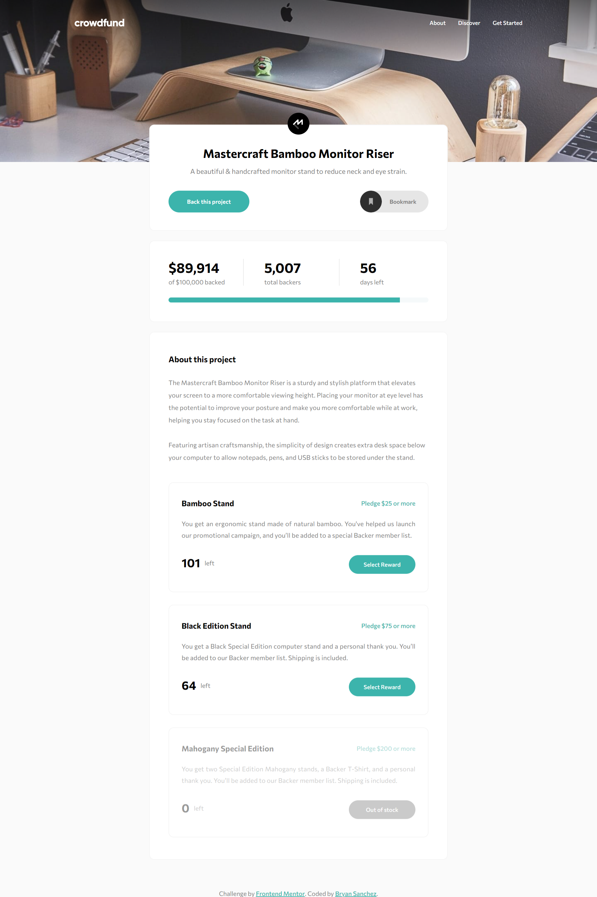

# Frontend Mentor - Crowdfunding product page solution

This is a solution to the [Crowdfunding product page challenge on Frontend Mentor](https://www.frontendmentor.io/challenges/crowdfunding-product-page-7uvcZe7ZR). Frontend Mentor challenges help you improve your coding skills by building realistic projects. 

## Table of contents

- [Frontend Mentor - Crowdfunding product page solution](#frontend-mentor---crowdfunding-product-page-solution)
  - [Table of contents](#table-of-contents)
  - [Overview](#overview)
    - [The challenge](#the-challenge)
    - [Screenshot](#screenshot)
    - [Links](#links)
  - [My process](#my-process)
    - [Built with](#built-with)
    - [What I learned](#what-i-learned)
    - [Continued development](#continued-development)
    - [Useful resources](#useful-resources)
  - [Author](#author)

**Note: Delete this note and update the table of contents based on what sections you keep.**

## Overview

### The challenge

Users should be able to:

- View the optimal layout depending on their device's screen size
- See hover states for interactive elements
- Make a selection of which pledge to make
- See an updated progress bar and total money raised based on their pledge total after confirming a pledge
- See the number of total backers increment by one after confirming a pledge
- Toggle whether or not the product is bookmarked

### Screenshot

### Links

- Solution URL: [Github](https://github.com/Bry-cmd/crowdfunding-product-page)
- Live Site URL: [Heroku](https://crowdfunding-product-page-bs.herokuapp.com/)

## My process

### Built with

- Semantic HTML5 markup
- CSS custom properties
- Syntactically Awesome Style Sheets (SASS)
- Flexbox
- CSS Grid
- [React](https://reactjs.org/) - JS library

### What I learned

I didn't really dedicate this project to learning anything new as I just wanted to use this challenge as an opportunity to improve on working with React.

### Continued development

I definitely want to improve on organizing my React skills and project files in the future. Although I think they're a lot better in this project than my last one, I definitely think there are still areas that I can get better in. I also want to start developing projects that incorporate back-end technologies like Express JS, Node JS, and MongoDB so that I can advance into full-stack development. Consequently, my next project may be easier on the front-end side since I really want to focus on working on the back-end aspect of the site.

I also want to improve on my CSS skills, specifically when it comes to transitions and animations since I'm not really familiar with those concepts yet.

### Useful resources

- [React Official Site](https://reactjs.org/) - The official docummentation of React has been an extremely useful site for getting my React project up and running.
- [CSS Tricks](https://css-tricks.com/) - This is a great website that has saved me a lot of times whenever I get confused on how to use flexbox and grid.
- [StackOverflow](https://stackoverflow.com/) - This is a great site that has answers to almost any question I can think of when it comes to programming.

## Author

- GitHub - [Bry-cmd](https://github.com/Bry-cmd)
- Frontend Mentor - [@Bry-cmd](https://www.frontendmentor.io/profile/Bry-cmd)
